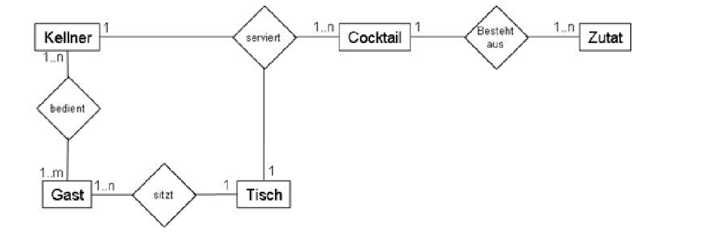

## Übungsaufgabe 2 - Cocktailbar

```
a) Überführen Sie das ER-Diagramm aus der Abbildung in ein
Klassendiagramm. Überlegen Sie sich dazu zusätzlich für jede
Entität geeignete Attribute und Operationen.
b) Geben Sie Beispieldaten für eine Tabellenstruktur an.
```

