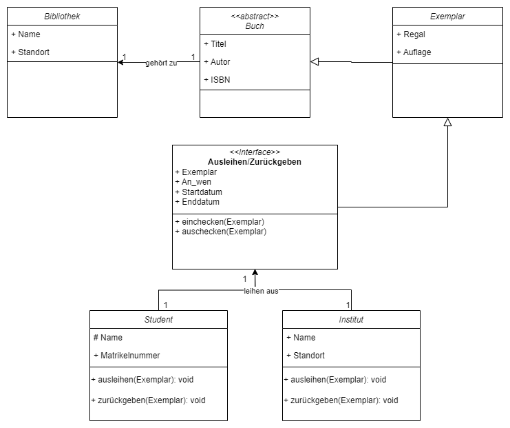

# Übungsaufgabe 3 - Bibliothek

Modellieren Sie die Datenstruktur eines Ausleihsystems in der Bibliothek.
Beachten Sie dabei:

- Von einem Buch kann es mehrere Auflagen geben.
- Von einem Buch können mehrere Exemplare in der Bibliothek vorhanden sein.
- Die Exemplare unterschiedlicher Auflagen können in unterschiedlichen Regalen liegen.
- Jedes Exemplar kann nur von einem Studenten (m/w) oder einer Organisation (z. B. einem Institut) ausgeliehen werden.
- Jede Entleihung hat ein Anfangs- und Enddatum.

## Lösung

