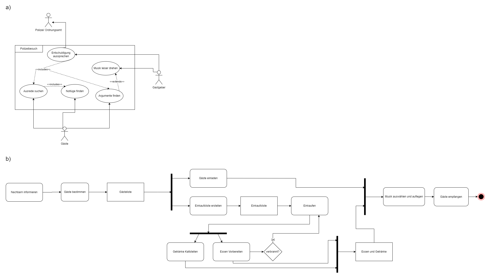

# Übungsaufgabe 6 - Party

Modellieren Sie in dieser Aufgabe das Feiern einer Party.

a)
Das Anwendungsfalldiagramm stellt den Anwendungsfall Polizeibesuch dar. Die dabei zu betrachtenden Akteure sind Gastgeber und Gäste (als Partyteilnehmer) und die Polizisten. 
Die zu modellierenden Anwendungsfälle sind „Ausrede suchen“, „Argumente finden“, „Notlüge finden“, „Musik leiser drehen“ und „Entschuldigung aussprechen“.

b)
Das Aktivitätsdiagramm soll den Prozess der Partyvorbereitung darstellen. 
Diese Vorbereitung umfasst Tätigkeiten wie Gäste bestimmen und einladen, einkaufen, Getränke kaltstellen, Essen vorbereiten, verbranntes Essen eventuell neu machen, Nachbarn informieren und Musik auswählen und auflegen. 
Alle diese Tätigkeiten sind in einen sinnvollen Zusammenhang zu bringen.

## Lösung

