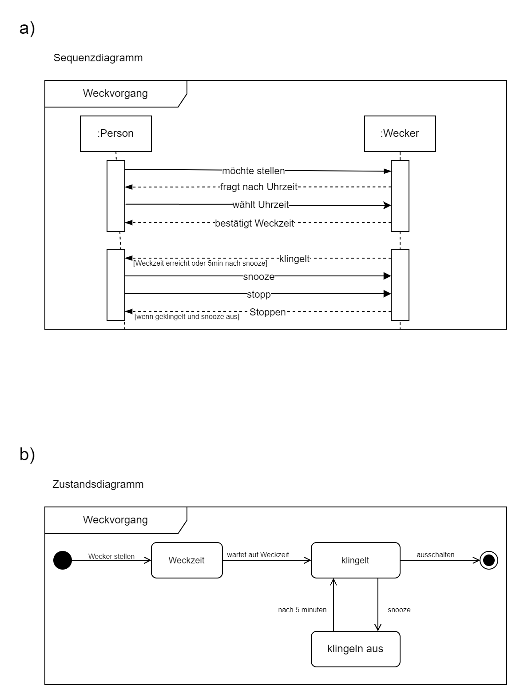

# Übungsaufgabe 10 - Wecker
Modellieren Sie unter Nutzung der UML-Diagramme (Sequenz- und Zustandsdiagramm) die Interaktion mit einem Wecker.

a)
Für den Weckvorgang des schlafenden Anwenders durch den
Wecker und die verschiedenen Handlungsmöglichkeiten nutzen
Sie bitte das Sequenzdiagramm. Dabei soll der Wecker
mindestens 3 einstellbare Weckzeiten und eine Snooze-
Funktion nach 5 Minuten haben.

b)
Für die Darstellung der verschiedenen Ansichten (Uhrzeit,
Weckzeiten, Datum) und die Einstellung der Uhrzeit und der
Weckzeiten (mindestens 3 verschiedene) verwenden Sie bitte das
Zustandsdiagramm.

## Lösung

