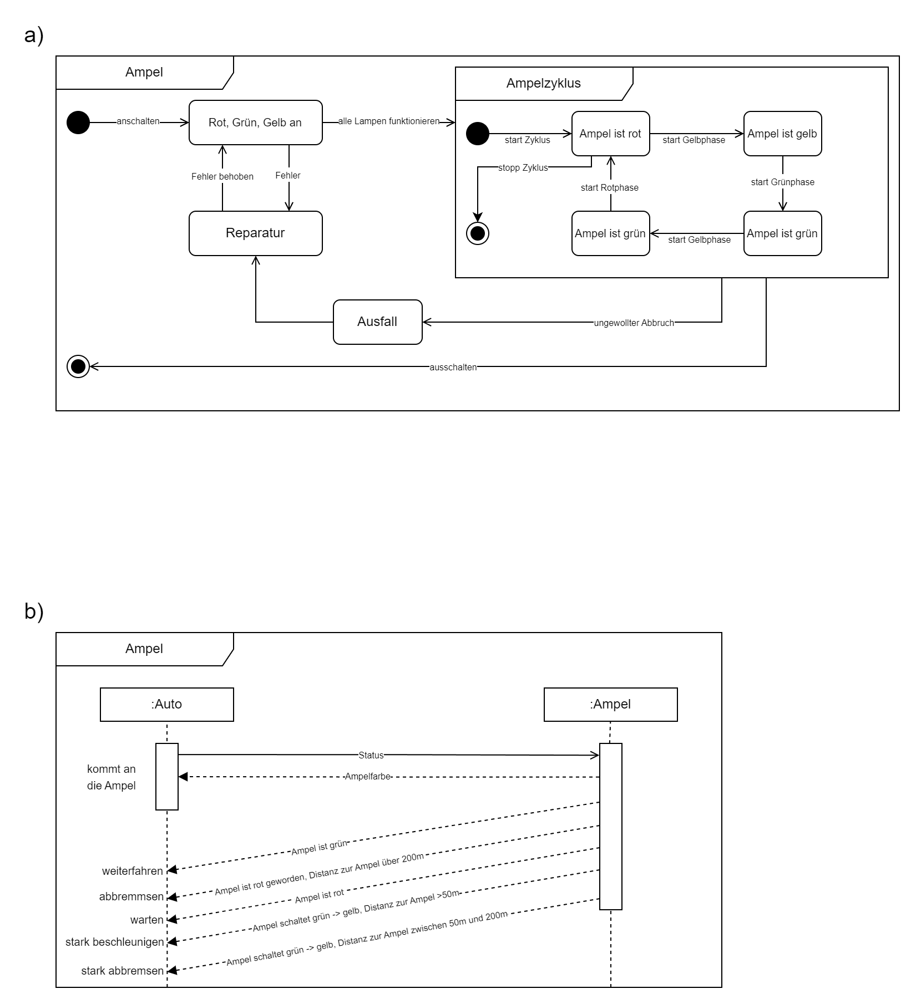

# Übungsaufgabe 11 - Ampel
Modellieren Sie unter Nutzung der UML-Diagramme (Sequenz- und Zustandsdiagramm) die Interaktionen mit einer Ampel.

a)
Für die verschiedenen Zustände einer Ampel und dem
angezeigten Licht verwenden Sie bitte das Zustandsdiagramm.
Dabei ist neben den drei verschiedenen Farben auch zu
beachten, dass eine Ampel ausfallen kann.

b)
Für die Interaktion zwischen einem Fahrzeug und einer Ampel
nutzen Sie bitte das Sequenzdiagramm. Dabei gibt es
verschiedene Aktionen, die durch die Ampel hervorgerufen
werden, wie beispielsweise das „weiter fahren“, „abbremsen“,
„warten“, „stark beschleunigen“ oder „stark abbremsen“.

## Lösung

