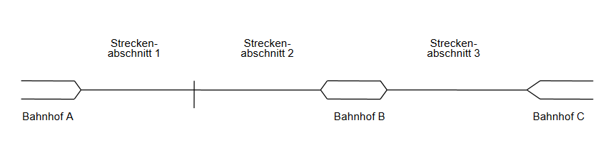

# Übungsaufgabe 16 – Bahnstrecke (II/II)

Die Markierung des Petri-Netzes soll folgende
Ausgangssituation darstellen:

- Im Bahnhof A stehen zwei Züge zur Abfahrt in Richtung C bereit.
- Im Bahnhof B steht ein Zug zur Abfahrt in Richtung A bereit.
- Stellen Sie einen möglichen Schaltzustand des Netzes nach zweimaligem Schalten des Netzes dar.

## Lösung

