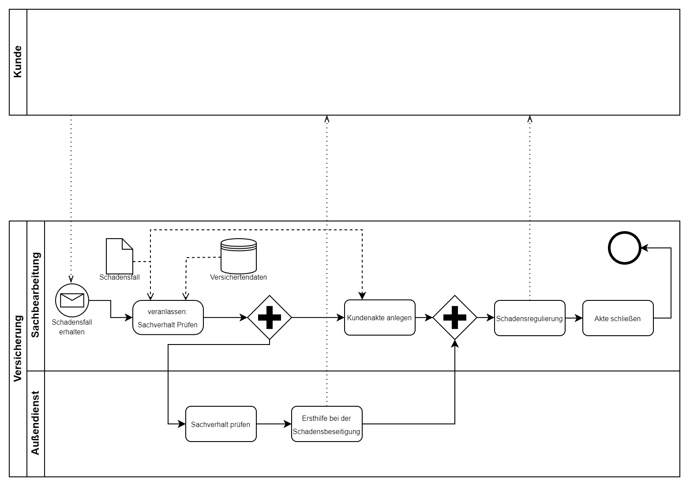

# Übungsaufgabe 19 – Schadensmeldung

Modellieren Sie den Ablauf einer Schadensabwicklung
zwischen Kunde und Versicherung:

- Ein Schaden tritt ein und wird von einem Kunden an die
Versicherung gemeldet, worauf ein Sachbearbeiter die Prüfung
des Sachverhaltes veranlasst.
- Die Prüfung des Sachverhaltes wird von einem
Außendienstmitarbeiter vorgenommen.
- Dieser bietet dem Kunden dann auch Ersthilfe bei der
Schadensbeseitigung an.
- Parallel dazu legt der Sachbearbeiter die Kundenakte für den
Schadensfall an.
- Sobald der Sachverhalt durch den Außendienst-MA geprüft
wurde, leitet der Sachbearbeiter die Regulierung des Schadens ein.
- Nach erfolgter Regulierung kann die Akte dann geschlossen
werden.

## Lösung

